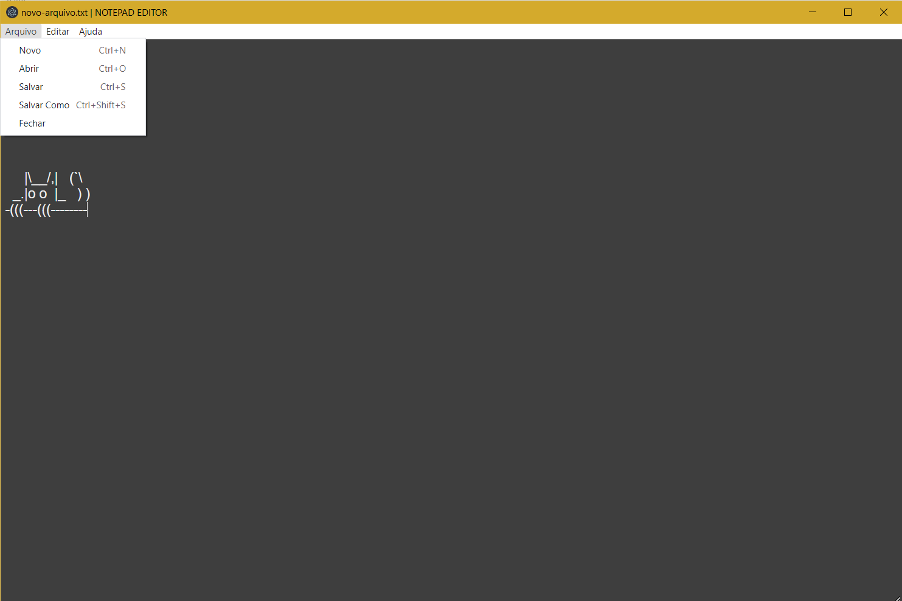

<h1 align="center"> Notepad em Electron </h1>

## Descrição do Projeto
<p>Um simples bloco de notas desenvolvido em electron</p>

<h4 align="center"> 
	✔  Finalizado  ✔
</h4>
  
## Como Usar

### Pré-requisitos

Antes de começar, você vai precisar ter instalado em sua máquina as seguintes ferramentas:
[Git](https://git-scm.com), [Node.js](https://nodejs.org/en/). 
Além disto é bom ter um editor para trabalhar com o código como [VSCode](https://code.visualstudio.com/)

### 🎲 Rodando a aplicação

```bash
# Clone este repositório
$ git clone <https://github.com/ItaloRez/Notepad-Electron->

# Acesse a pasta do projeto no terminal/cmd
$ cd Notepad-Electron-

# Instale as dependências
$ npm install

# Execute a aplicação 
$ npm start
```

## 🛠 Tecnologias

As seguintes ferramentas foram usadas na construção do projeto:

- [Electron](https://www.electronjs.org/)
- [Javascript](https://www.javascript.com/)
- [HTML](https://developer.mozilla.org/pt-BR/docs/Web/HTML)
- [CSS](https://developer.mozilla.org/pt-BR/docs/Web/CSS)

## Demonstração

<h1 align="center">
  
</h1>


## Autor

 </img>
 <br/>
 <sub><b>Ítalo de Rezende</b></sub>🚀


Feito por Ítalo de Rezende 👋🏽 Entre em contato!


[](https://www.linkedin.com/in/%C3%ADtalo-rezende-60a5571b2/) 

[](mailto:italo.rezende@gec.inatel.br)


## Licença


